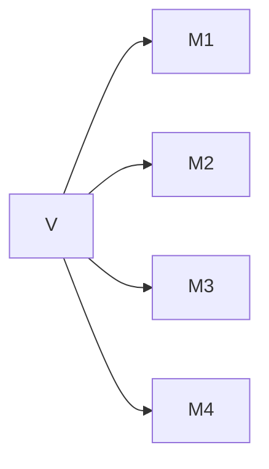
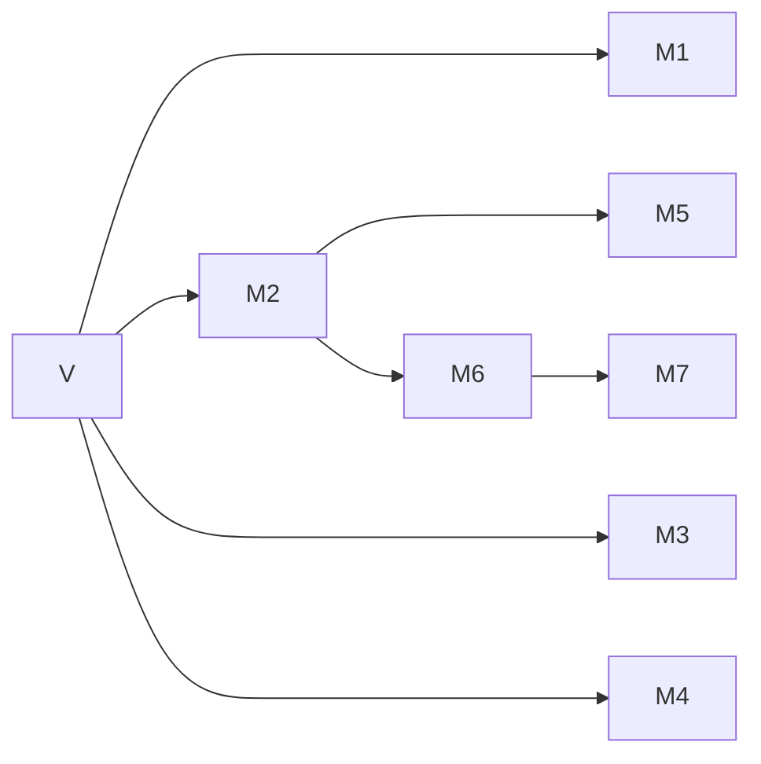
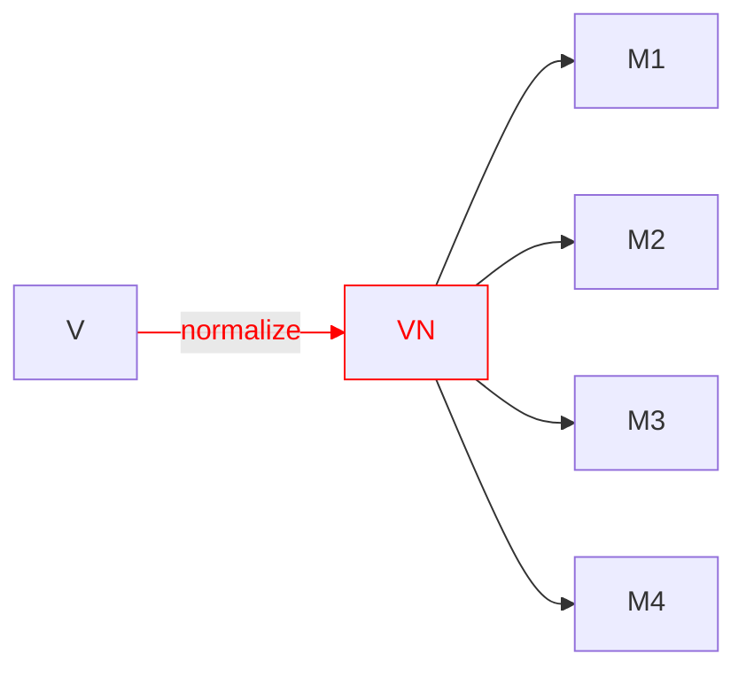
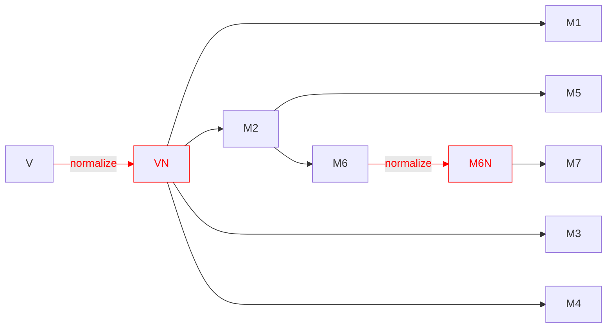
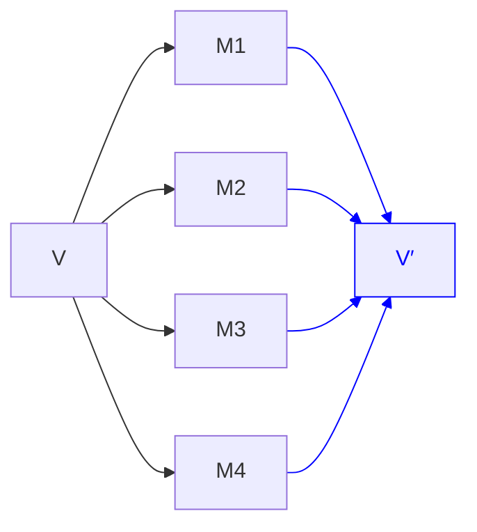
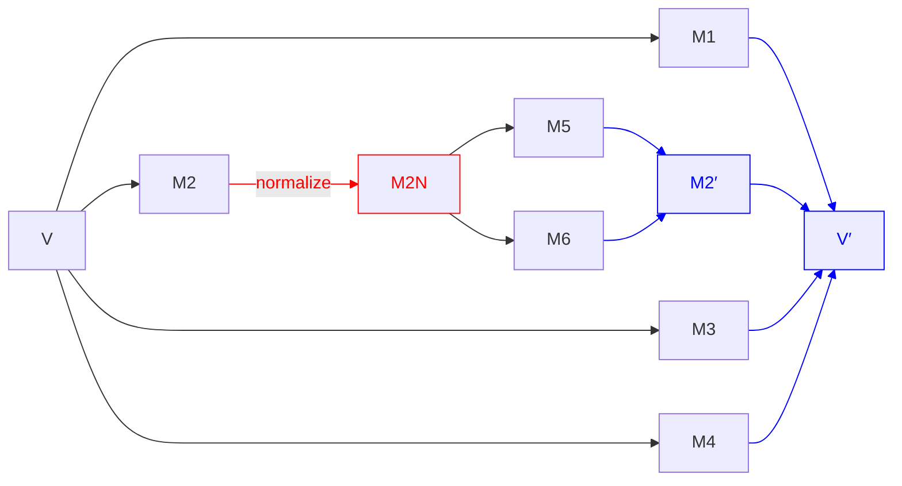

# Revision History

Since [@P3380R0], extended section on [normalization](#normalization) to talk about string literals and proposing properly handling string literals.

# Introduction

This paper is conceptually a follow-up to [@P2484R0], except that it's largely a new design, and I haven't heard back from Richard Smith and didn't want to put his name on ideas I'm not sure he agrees with, despite everything in this paper being derived from his insights.

Recommended reading in advance:

* [@P0732R2] first introduced class types as non-type template parameters, based on defaulted `<=>`. This got later changed to be based on defaulted `==`.
* [@P1907R0] pointed out issues and limitations in this approach
* [@P1907R1] was a revised design based on the concept of structural types, not equality, and was what was adopted for C++20.
* Davis Herring has a great StackOverflow answer [here](https://stackoverflow.com/questions/63694879/floating-point-types-as-template-parameter-in-c20/63714924#63714924) detailing a lot of these issues.
* [@P2484R0] was an idea for C++23 to extend support for class types as non-type template parameters to handle many of the remaining easy cases.
* A [blog post](https://brevzin.github.io/c++/2024/08/15/cnttp/) I wrote on this topic

The status quo right now is that class types that have all of their subobjects public and structural can be used as non-type template parameters. This was an extremely useful addition to C++20, but leaves a lot to be desired. The goal of this paper is to provide a design that will allow all types to be usable as non-type template parameters, provided the correct opt-in. In order to do so, I have to first introduce three concepts: serialization, normalization, and deserialization.

## Serialization

All the work at this point has established pretty clearly that template argument equivalence is a serialization problem. What the defaulted-`<=>` design established, and then the defaulted-`==` design and the structural type design preserved, was that we need to treat a class type as being comprised of a bunch of scalar types and having equivalence be based on those scalars.

However we generalize the non-type template parameter problem to more interesting class types is going to require a mechanism for the user to tell the compiler how their class decomposes. Put differently: how can the compiler serialize your class.

More formally, serialization takes a value `v` and explodes it into some tuple of structural types:



Since the resulting types have to themselves be structural, that means they themselves can be (recursively) serialized. Regardless of what mechanism we could use to specify serialization, the compiler can do the recursive part itself without any user input. So in real life it might look more like this (where the values in the right-most column are those scalar/pointer/reference types that cannot further decompose):



There are many types for which default subobject-wise serialization is actually sufficient — types like `std::tuple<Ts...>`, `std::optional<T>`, `std::expected<T, E>`, `std::variant<Ts...>`, `std::string_view`, `std::span<T>`, etc. For such types, the problem reduces to simply coming up with the right syntax to express that opt-in.

But for other types, simply serializing all the subobjects is insufficient. We have to do a little bit more.

## Normalization

One of the examples that got brought up frequently during discussion is:

::: std
```cpp
struct Fraction {
    int num;
    int denom;
};
```
:::

Should `Fraction{1, 2}` be able to be template-argument-equivalent to `Fraction{2, 4}`? That is, should the serialization process be allowed to also do normalization? Maybe you want to minimize your template instantiations?

I find this particular example difficult to reason about whether it matters, but there is another that I think is more compelling (courtesy of Richard Smith). Consider:

::: std
```cpp
class SmallString {
    char data[32];
    int length = 0; // always <= 32

public:
    // the usual string API here, including
    SmallString() = default;

    constexpr auto data() const -> char const* {
        return data;
    }

    constexpr auto push_back(char c) -> void {
        assert(length < 31);
        data[length] = c;
        ++length;
    }

    constexpr auto pop_back() -> void {
        assert(length > 0);
        --length;
    }
};
```
:::

And add a few functions:

::: std
```cpp
template <SmallString S> struct C { };

constexpr auto f() -> SmallString {
    auto s = SmallString();
    s.push_back('x');
    return s;
}

constexpr auto g() -> SmallString {
    auto s = f();
    s.push_back('y');
    s.pop_back();
    return s;
}
```
:::

Now, we might consider the values returned by `f()` and `g()` to be equal — they're both strings of length 1 whose single character is `x`. But they have different contents of their `data` arrays. So if we do default subobject-wise equivalence (i.e. the C++20 rule), then `C<f()>` and `C<g()>` would be different types. This is unlikely to be the desired effect.

If instead of subobject-wise equivalence, we instead did custom serialization — if we only serialized the contents of `data[:length]` (such that `f()` and `g()` serialize identically), then we have a different problem. Consider:

::: std
```cpp
template <SmallString S>
constexpr auto bad() -> int {
  if constexpr (S.data()[1] == 'y') {
    return 0;
  } else {
    return 1;
  }
}
```
:::

What do `bad<f()>()` and `bad<g()>()` evaluate to, `0` or `1`? Or both? This is an ODR violation, and would be a very bad outcome that we (at least Richard and I) desperately want to avoid.

So far then we have two options for `SmallString`:

1. Opt-in to member-wise equivalence, which leads to two equal values being non-equivalent.
2. Custom serialization, which can lead to ODR violations.

Instead, we can do something else. Prior to serialization, we can optionally perform an extra normalization step. In this case, first we would normalize the representation (by setting `data[length:32]` to `0`) and then we would serialize.

Visually:



Which would naturally recurse:



With such a normalization step, we can get `f()` and `g()` to be template-argument-equivalent in a way that avoids any ODR issues, since now their representations are actually identical.

### String Literals

Another highly motivating use-case for normalization is actually string literals. Currently, string literals are not usable as non-type template parameters. [@P0424R2] tried to address this issue, but was dropped in favor of [@P0732R2]. The latter, while a highly useful addition to the language, technically did not solve the former problem though.

The problem with string literals is that template-argument equivalence for pointers is defined as two pointers having the same pointer value. Which isn't necessarily true for string literals in different translation units.

But this is precisely a use-case for normalization! And the model [@P0424R2] implies basically gets us there, it just needs to be formalized. Basically: if `p` points to a string literal, or a subobject thereof, we can first normalize it by having it instead point to an external linkage array that is mangled with the contents of the string. That is, this:

::: std
```cpp
template <auto V> struct C { };

struct Wrapper { char const* p; };

C<"hello"> c1;
C<Wrapper{.p="hello"}> c2;
```
:::

Can normalize (recursively) into:

::: std
```cpp
template <char const* V> struct C { };

inline constexpr char __hello[] = "hello";
C<__hello> c1;
C<Wrapper{.p=__hello}> c2;
```
:::

As long as we ensure that the backing array has external storage such that the same contents lead to the same variable (which [@P3491R0] demonstrates a library implementation of), this will actually do the right thing. We end up with exactly what users expect, in the way that [@P0424R2] hoped to achieve.

However, this still isn't sufficient...

## Deserialization

Consider `std::vector<T>`. One possible representation of this is:

::: std
```cpp
template <typename T>
class vector {
    T* begin_;
    size_t size_;
    size_t capacity_;
};
```
:::

For our purposes it doesn't matter if `size_t` and `capacity_` are themselves `size_t` or `T*`, so I'm picking the simpler one to reason about.

The template-argument-equivalence rule for pointers is that two pointers are equivalent if they have the same pointer value. That's not what we want for comparing two `std::vector<T>`s though, we want to compare the contents. In order for the default, subobject-wise equivalence to work in this case, we'd have to normalize the pointers to be _identical_. For `std::vector<T>` specifically, this is potentially feasible using a `std::meta::define_static_array` function that will be proposed as part of the reflection proposal ([@P2996R5], although it does not appear yet in that revision). But that's not going to help us with `std::map`, `std::list`, or any other container.

For `std::vector<T>`, we really need to serialize a variable-length sequence of `T`s.

As we already saw in the previous section, custom serialization (by which I mean serialization that isn't simply serializing every subobject) can lead to ODR violations if two different objects serialize the same.

This is where deserialization comes in. We say that the template argument value that the user sees in code is the result of first serializing the value, and then passing that serialized state back into the class to construct a new value. Whatever the resulting value that we get out of deserialization, that is _reliably_ the value of the template argument for all values of the original type that compare template-argument-equivalent to each other. We don't have to worry about which of a bunch of possible specializations is chosen by the compiler/linker.

Deserialization actually implicitly does normalization — the roundtrip of a value through (de)serialization is normalized. But while ODR problems can be avoided by careful use of normalization, ODR problems are avoided entirely by construction if we require deserialization. That's pretty appealing. And the process can have some added checks too! The compiler can perform one extra serialization step to ensure that:

::: std
```cpp
serialize(deserialize(serialize(v))) === serialize(v)
```
:::

This check ensures that the round-trip is sound by construction.

In the same way that serialization converts a value into a tuple of structural types, deserialization starts with that tuple of structural types and produces a possibly-new value of the original type:



And in the same way that serialization works recursively in a way that the compiler can take care of for you, deserialization could too. And it's important that it work like this for the same reason. So a more complex diagram might be:



Note that the serialization logic produces <code>M2</code> but the deserialization logic only sees <code>M2′</code>, without the class author having to worry about how to produce it.

## Soundness

There are three approaches that are sound — that is, they avoid ODR issues.

1. Subobject-wise serialization.
2. Subobject-wise serialization with an initial normalization step.
3. Custom serialization with custom deserialization.

Subobject-wise serialization alone (1) already gives us a tremendous amount of value (since this gives us `std::tuple`, `std::optional`, `std::expected`, `std::variant`, `std::span`, and `std::string_view`, among many other types) while still being sound, but we really need custom serialization/deserialization (3) to get the rest of the types (the containers). Allowing normalization (2) helps a small number of types avoid doing all the work that (3) would necessitate.

## Original Design

The [@P2484R0] design was a custom serialization/deserialization design. Given a class type `C`:

* serialization was done by way of an `operator template()` which had to return type `R`, which had to be structural.
* deserialization was done by way of a constructor from `R`.

This approach does satisfy the overall goal of avoiding ODR issues (although the paper does not mention this at all), but the design had some issues.

For one, it doesn't cleanly support the case where we just want member-wise template argument equivalence but our members happen to be `private` (the `tuple`/`optional`/`variant` cases). The paper tried to address this by allowing you to declare `operator template()` as _defaulted_, which doesn't really seem semantically equivalent to the non-defaulted case. A defaulted copy constructor or comparison operator _can_ be written by hand, if tediously, but a defaulted `operator template` would require you duplicating the whole type just to copy it?

Another problem it doesn't clearly support variable-length data. How do we serialize `std::vector<int>`? `std::string`? The `SmallString` class from earlier? The paper kind of punted on this question, suggesting that maybe we just make `std::vector<T>` a structural type by fiat since the language can just know what it means. That's not actually all that unreasonable, but it is a bit unsatisfying.

But it's at least not a bad start. There's a lot to like about this approach:

* it's actually a fairly straightforward way to handle serialization and deserialization, so it does get at the most desirable model for how to extend support for class types as non-type template parameters
* it can properly handle reference members — which must have their template argument equivalence defined as the identity of the object referred to, not its value
* it prevents attempting to do the wrong thing with pointer members.

What I mean by the last point is: how do you define template argument equivalence for `std::string_view`? There's really only one way to do it: as if it were a `std::pair<char const*, size_t>`. If you try to do it the other way (comparing the contents), you'll run into problems on the deserialization side:

::: std
```cpp
class string_view {
    // let's just simplify and ignore the template parameters
    char const* ptr_;
    size_t len_;

    // incorrect approach to serialization
    struct Repr { std::vector<char> v; };
    consteval auto operator template() const -> Repr {
        return Repr{.v=std::vector<char>(ptr_, ptr_ + len_)};
    }

    // the only possible thing deserialization could do?
    consteval string_view(Repr r)
        : ptr_(r.data())
        , len_(r.size())
    { }
}
```
:::

If we serialize the `string_view` as a `vector<char>`, the only way to deserialize would be to refer to the contents of that `vector`. Which immediately goes out of scope, and the compiler can detect that. `ptr_` has to be a permitted result of a constant expression — basically that it has to point to something with static storage duration. And the transient `constexpr` allocation _is not_ that. This error can be detected at compile time.

And that will push you to having the `operator template` implementation for `string_view` be just be defaulted — the correct implementation.

# Reflection Will Fix It

One of the issues with the serialization problem that we had to deal with was: how exactly do you serialize? What representation do you return? And then how do you deserialize again? This was where we got stuck with types like `std::vector` (which needs variable-length representation) and even `std::tuple` (which has a simple answer for serialization but you don't want to just create a whole new tuple type for this). Faisal Vali had the insight that reflection provides a very easy answer for this question: you serialize into (and then deserialize from) a range of `std::meta::info`!

Let's start with `SmallString` again. We wanted to serialize just the objects in `data[0:length]`:

::: std
```cpp
class SmallString {
    char data[32];
    int length;

    consteval auto operator template() const -> std::vector<std::meta::info> {
        std::vector<std::meta::info> repr;
        for (int i = 0; i < length; ++i) {
            repr.push_back(std::meta::reflect_value(data[i]))
        }
        return repr;
    }
};
```
:::

Here, we will return somewhere from 0 to 32 reflections of values of type `char`. And then when we deserialize, we extract those values back:

::: std
```cpp
class SmallString {
    // a tagged constructor to make overload resolution
    // easier to reason about
    consteval SmallString(std::meta::from_template_t,
                          std::vector<std::meta::info> repr)
        : data() // zero out the data first
        , length(repr.size())
    {
        for (int i = 0; i < length; ++i) {
            data[i] = extract<char>(repr[i]);
        }
    }
};
```
:::

And this pattern works just as well for `std::vector<T>`, which truly requires variable length contents:

::: std
```cpp
template <typename T>
class vector {
    T* begin_;
    size_t size_;
    size_t capacity_;

    struct Repr {
        std::unique_ptr<std::meta::info const[]> p;
        size_t n;

        consteval auto data() const -> std::meta::info const* {
            return p.get();
        }
        consteval auto size() const -> size_t {
            return n;
        }
    };

    consteval auto operator template() const -> Repr {
        auto data = std::make_unique<std::meta::info const[]>(size_);
        for (size_t i = 0; i < size_; ++i) {
            data[i] = std::meta::reflect_value(begin_[i]);
        }
        return Repr{
            .p=std::move(data),
            .n=size_,
        };
    }

    consteval vector(std::meta::from_template_t,
                     Repr r)
    {
        begin_ = std::allocator<T>::allocate(r.size());
        size_ = capacity_ = r.size();
        for (size_t i = 0; i < size_; ++i) {
            ::new (begin_ + i) T(extract<T>(r.p[i]));
        }
    }
};
```
:::

There are two additional points of interest in this example:

1. Note that here we're using `Repr` instead of `std::vector<std::meta::info>`. The compiler needs to understand what this return type is, but it doesn't _need_ to be `std::vector`. Instead, we can take a page out of the design of `static_assert` with user-defined messages [@P2741R3] — it doesn't require `std::string` specifically, just any type for which `M.data()` is convertible to `char const*` and `M.size()` is convertible to `size_t`. We could do the same, simply requiring that `R.data()` is convertible to `std::meta::info const*`.

2. While this didn't matter for `SmallString`, here we are round-tripping through `reflect_value` and `extract` for arbitrary (structural) `T`. This round-trip also needs to do the custom serialization and deserialization for `T` if that's what the user wants, and will happen automatically without the class author having to do anything.

The approach of serializing and deserializing through a contiguous range of `std::meta::info` is pretty nice. It definitely solves the problem, avoiding having to special-case `std::vector`.

But it's not super convenient for some of the other types that we've mentioned.

It's... fine but not amazing for `Optional`:

::: std
```cpp
template <typename T>
class Optional {
    union { T value; };
    bool engaged;

    // Here, we don't need to use vector<info> since we know we have
    // at most one value to represent and we already have a
    // convenient answer for disengaged: the null reflection
    struct Repr {
        std::meta::info r;

        explicit operator bool() const {
            return r != std::meta::info();
        }

        consteval auto data() const -> std::meta::info const* {
            return *this ? &r : nullptr;
        }
        consteval auto size() const -> size_t {
            return *this ? 1 : 0;
        }
    };

    consteval auto operator template() -> Repr {
        if (engaged) {
            return Repr{.r=meta::reflect_value(value)};
        } else {
            return Repr{.r=meta::info()};
        }
    }

    consteval Optional(meta::from_template_t, Repr repr)
        : engaged(repr)
    {
        if (engaged) {
            ::new (&value) T(extract<T>(repr.r));
        }
    }
};
```
:::

But it's... really not the best for `tuple`:

::: std
```cpp
template <typename... Ts>
class Tuple {
    // let's assume this syntax works (because the details are not important here)
    Ts... elems;

    // Note that here we're returning an array instead of a vector
    // just to demonstrate that we can
    consteval auto operator template() -> array<meta::info, sizeof...(Ts)> {
        array<meta::info, sizeof...(Ts)> repr;
        size_t idx = 0;
        template for (constexpr auto mem : nonstatic_data_members_of(^Tuple) {
            // references and pointers have different rules for
            // template-argument-equivalence, and thus we need to
            // capture those differences... differently
            if (type_is_reference(type_of(mem))) {
                repr[idx++] = reflect_object(this->[:mem:]);
            } else {
                repr[idx++] = reflect_value(this->[:mem:]);
            }
        }
        return repr;
    }

    consteval Tuple(meta::from_template_t tag,
                    array<meta::info, sizeof...(Ts)> repr)
        : Tuple(tag, std::make_index_sequence<sizeof...(Ts)>(), repr)
    { }

    template <size_t... Is>
    consteval Tuple(meta::from_template_t,
                    index_sequence<Is...>,
                    array<meta::info, sizeof...(Ts)> repr)
        : elems(extract<Ts>(repr[Is]))...
    { }
}
```
:::

Cool. This is... a lot. Not only is it a lot of decidedly non-trivial code to write, it's a lot of code that doesn't really do all that much. We're _just_ doing the default member-wise equivalence here. On the one hand, it's good that we _can_ do this. But it's not really great that we _have to_. This is, after all, the default.

One thing this suggests is that: if this is the default, we should be able to say that it is the `default`:

::: std
```cpp
template <typename... Ts>
class Tuple {
    Ts... elems;

    consteval auto operator template() = default;
    consteval Tuple(meta::from_template_t, auto repr) = default;
}
```
:::

I don't like this for three reasons. First, we have to default two different functions for what is effectively one operation that we're defaulting. Second, what actually does `operator template` return here? Third, while this makes the `optional`, `tuple`, and `variant` implementations a lot easier, it doesn't help for those types that actually want to do some normalization (like `SmallString`).

But I think there's still a good solution for this problem that actually does solve all of these cases: allow `operator template` to return `void`!

That is: if `operator template` returns `void`, then we still invoke the function — it might do normalization — but we're sticking with default member-wise serialization, which means that we don't need a custom deserialization function. In effect, an `operator template` returning `void` would be the "opt in" that C++20 lacked for the case where you want member-wise equivalence but have private members. This approach makes the `optional`/`tuple`/etc. cases trivial:

::: std
```cpp
template <typename T>
class Optional {
    union { T value; };
    bool engaged;

    consteval auto operator template() -> void { }
};

template <typename... Ts>
class Tuple {
    Ts... elems;

    consteval auto operator template() -> void { }
}
```
:::

While also making it very easy to implement the normalization case:

::: std
```cpp
class SmallString {
    char data[32];
    int length;

    consteval auto operator template() -> void {
        std::fill(this->data + this->length, this->data + 32, '\0');
    }
};
```
:::

The `void`-returning case does at some complexity on top of the full serialization-deserialization design, but it makes the opt-in for a large amount of types a very sensible one-liner, so I think it's worth it.

## Interesting Edge Case

I wanted to show an interesting edge case. While the idea presented here seems to solve all of the types I can reasonably think of — all the standard library types mentioned here, both the simple ones (`tuple`/`optional`/`variant`/etc) and the containers — I can come up with an example that seems a little awkward. Consider:

::: std
```cpp
class Fun {
    std::vector<int> elems;
    int* best; // within elems
};
```
:::

Today, this type isn’t structural because it has private members. But in this case we don’t need to do anything special, just member-wise equivalence, so it’s tempting to think that we can just do this:

::: std
```cpp
class Fun {
    std::vector<int> elems;
    int* best; // within elems

    consteval auto operator template() -> void { }
};
```
:::

But... that's not quite right. The rules I laid out above say that after we invoke `operator template`, we normalize all of the members. Which, for `elems` is going to reallocate such that `best` no longer points within there. This should end up failing to compile because `best` will not be a valid pointer (for not pointing to persistent memory).

There are three ways I can think of to make this particular type work.

The first is with a custom serialization, which we would do by serializing the index rather than the pointer:

::: std
```cpp
class Fun {
    std::vector<int> elems;
    int* best; // within elems

    consteval auto operator template() -> std::vector<std::meta::info> {
        return {
            std::meta::reflect_value(elems),
            std::meta::reflect_value(best - elems.data())
        }
    }

    consteval Fun(std::meta::from_template_t, std::vector<std::meta::info> repr)
        : elems(extract<std::vector<int*>>(repr[0]))
        , best(extract<ptrdiff_t>(repr[1]) + elems.data())
    { }
};
```
:::

That works, but is annoying.

The second is to make the rules a bit more complicated and actually allow this:

::: std
```cpp
class Fun {
    std::vector<int> elems;
    int* best; // within elems

    consteval auto operator template() -> void {
        auto delta = best - elems.data();
        elems.operator template(); // explicitly normalize
        best = elems.data() + delta;
    }
};
```
:::

That is, here we _explicitly_ normalize `elems`, so the compiler will not later _implicitly_ normalize it. This obviously makes for a simpler implementation of `Fun`, but is it actually worth complicating the rules for? I don't think so.

The last way is to change what we return. Right now, I'm just saying that you can return any contiguous range of `std::meta::info`. In a way, that's basically... type erasure. Sure, it's type erasure that we can't get wrong (`extract` won't work if you provide the wrong type), but it's still a bit surprising in a strongly type language. So what if instead we allowed the original [@P2484R0] design:

::: std
```cpp
class Fun {
    std::vector<int> elems;
    int* best; // within elems

    struct Repr {
        std::vector<int> elems;
        ptrdiff_t index;
    };

    consteval auto operator template() -> Repr {
        return {
            .elems=elems,
            .index=best - elems.data()
        };
    }

    consteval Fun(std::meta::from_template_t, Repr r)
        : elems(std::move(r).elems)
        , best(elems.data() + r.index)
    { }
};
```
:::

This seems like a much better approach than the explicit normalization one — but I'm still not sure it's actually worth pursuing. It doesn't add too much complexity to the design (once we can return two different kinds, is it really that big a deal to return three different kinds?), but we should really only go this route if this is a sufficiently common use-case. Which I'm not sure it is.

## Alternate Spelling

Following the principle that the way to spell the operator invoked in the expression `c[x]` is `operator[]`, an alternate spelling to the way to spell the operator invoked in the `$type-id$` `C<x>` could be `operator<>` (instead of `operator template`).

Ultimately I prefer `operator template`, simply because of the added searchability of using words instead of punctuation, and this invocation will never appear in code, so there is no added value of terseness.

## Splitting

There are two forms of this proposal:

1. `T::operator template()` returns a range of reflections and `T` is constructible from that range,
2. `T::operator template()` returns `void`.

The first form is the full round-trip custom serialization/deserialization path that can support any type and is essential for containers. The second is a purely convenience form for simplicity, although one that covers a wide range of very common types (like `std::tuple`, `std::optional`, `std::variant`, `std::string_view`, `std::span`, etc.).

However, the first form also depends on reflection [@P2996R5] and the latter does not. It is possible to adopt purely the `void`-returning form first with the understanding that we can later extend it to the reflection-range-returning form. This immediately gives us support for many useful types, and we can't use types like `std::vector<T>` or `std::string` as non-type template parameters yet anyway — not until we get non-transient constexpr allocation ([@P1974R0] [@P2670R1]).

So it's worth considering a reduced form of this proposal that is simply the `void`-returning form. This also has significantly less implementation complexity, since it's not a large extension over the existing rule.

# Proposal

This proposal extends class types as non-type parameters as follows. This isn't exactly Core wording, but does contain something akin to wording because I think that might be a clearer way to express the idea.

## Language

First, as with [@P2484R0], I'm referring to `operator template` as a template representation function. A class type `T` can provide an `operator template` that must be `consteval`, with one of two forms:

1. It returns `void`, in which case every base class and non-static data member shall have structural type and none of them shall be `mutable`.
2. It returns some value `R` such that:
    a. `R.data()` is convertible to `std::meta::info const*`, `R.size()` is convertible to `size_t`, and `static_cast<std::meta::info const*>(R.data())[i]` shall be valid for all `0 <= i < static_cast<size_t>(R.size())`, and
    b. `T(std::meta::from_template, R)` is a valid expression (where `std::meta::from_template` is a value of tag type `std::meta::from_template_t`).

As with [@P2484R0], I think I still want this function to be non-user-invocable.

Second, we introduce the concept of template argument normalization and allow string literal template arguments:

::: std
A value `v` of structural type `T` is *template-argument-normalized* as follows:

* [#]{.pnum} If `v` is a pointer or reference to a string literal or subobject thereof, it is instead changed to point or refer to an external linkage constexpr array that contains the same values as `v`, such that the same string literal in different translation units would normalize to point or refer into the same array.
* [#]{.pnum} Otherwise, if `T` is a scalar type or an lvalue reference type, nothing is done.
* [#]{.pnum} Otherwise, if `T` is an array type, every element of the array is template-argument-normalized.
* [#]{.pnum} Otherwise (if `T` is a class type), then
  * [#.#]{.pnum} If `T` provides a template representation function that returns `void`, then that function is invoked on `v` and then every subobject of `v` is template-argument-normalized.
  * [#.#]{.pnum} Otherwise, if `T` provides a template representation function that returns a reflection range, then the new value `T(std::meta::from_template, v.operator template())` is used in place of `v`.
  * [#.#]{.pnum} Otherwise (if `T` does not provide a template registration function), then every subobject of `v` is template-argument-normalized.
:::

and [temp.arg.nontype]{.sref}/6.2:

::: std
[6]{.pnum} For a non-type template-parameter of reference or pointer type, or for each non-static data member of reference or pointer type in a non-type template-parameter of class type or subobject thereof, the reference or pointer value shall not refer or point to (respectively):

* [6.#]{.pnum} a temporary object ([class.temporary]),

::: rm
* [6.#]{.pnum} a string literal object ([lex.string]),
:::

* [6.#]{.pnum} the result of a typeid expression ([expr.typeid]),
* [6.#]{.pnum} a predefined `__func__` variable ([dcl.fct.def.general]), or
* [6.#]{.pnum} a subobject ([intro.object]) of one of the above.
:::

Status quo so far is that *template-argument-normalization* is a no-op for all types.

Third, we change the meaning of `std::meta::reflect_value` in [@P2996R5] to perform template-argument-normalization on its argument.

Fourth, we extend the definition of structural (here it's either the first bullet or both of the next two — the additional rules on template registration functions will be covered in their own section):

::: std
A *structural type* is one of the following:

* [7.1]{.pnum} a scalar type, or
* [7.2]{.pnum} an lvalue reference type, or
* [7.2b]{.pnum} [an array type whose element type is structural, or]{.addu}
* [7.3]{.pnum} a literal class type with the following properties:
    * [7.3.0]{.pnum} [the class has an eligible template representation function, or]{.addu}
    * [7.3.1]{.pnum} all base classes and non-static data members are public and non-mutable and
    * [7.3.2]{.pnum} the types of all bases classes and non-static data members are structural types [or (possibly multidimensional) array thereof]{.rm}.
:::

Fifth, we extend the definition of *template-argument-equivalent* (note that two values of type `std::meta::info` that represent values compare equal if those values are template-argument-equivalent, so this definition is properly recursive):

::: std
Two values are *template-argument-equivalent* if they are of the same type and [...]

* [2.11]{.pnum} they are of class type [`T`]{.addu} and

    * [2.11.1]{.pnum} [If `T` has an eligible template representation function that returns non-`void`, then let `r1` and `r2` be the results of invoking the template registration function on the two values. The values are considered template argument equivalent if `r1.size() == r2.size()` and, for each `i` such that `0 <= i < r1.size()`, `r1.data()[i] == r2.data()[i]`.]{.addu}
    * [2.11.2]{.pnum} [Otherwise, if]{.addu} their corresponding direct subobjects and reference members are template-argument-equivalent.
:::

Sixth, ensure that when initializing a non-type template parameter of class type, that we perform template-argument-normalization (so that the above rule on equivalence is only ever performed on normalized values).

## Library

Add a new tag type, `std::meta::from_template_t` and value of it named `std::meta::from_template`.

Add a new type trait for `std::is_structural`, which we will need to provide constrained template registration functions (a real use, as [@LWG3354] requested).

Add a `consteval void operator template() { }` (that is, the default subobject-wise serialization with no normalization) to all of the following library types, suitably constrained:

* `std::tuple<Ts...>`
* `std::optional<T>`
* `std::expected<T, E>`
* `std::variant<Ts...>`
* `std::basic_string_view<CharT, Traits>`
* `std::span<T, Extent>`
* `std::chrono::duration<Rep, Period>`
* `std::chrono::time_point<Clock, Duration>`

There may need to be some wording similar to what we have for in [\[pairs.pair\]/4](http://eel.is/c++draft/pairs.pair#4) right now:

::: std
[4]{.pnum} `pair<T, U>` is a structural type ([temp.param]) if `T` and `U` are both structural types.
Two values `p1` and `p2` of type `pair<T, U>` are template-argument-equivalent ([temp.type]) if and only if `p1.first` and `p2.first` are template-argument-equivalent and `p1.second` and `p2.second` are template-argument-equivalent.
:::

# Acknowledgements

Thanks to Richard Smith and Davis Herring for all the work in this space. Thanks to Jeff Snyder for originally seeing how to solve this problem (even if we didn't end up using his original solution). Thanks to Faisal Vali and Daveed Vandevoorde for working through a solution.

---
references:
  - id: P3491R0
    citation-label: P3491R0
    title: "`define_static_string` and `define_static_array`"
    author:
      - family: Peter Dimov
      - family: Dan Katz
      - family: Barry Revzin
      - family: Daveed Vandevoorde
    issued:
      - year: 2024
        month: 11
        day: 03
    URL: https://wg21.link/p3491r0
---