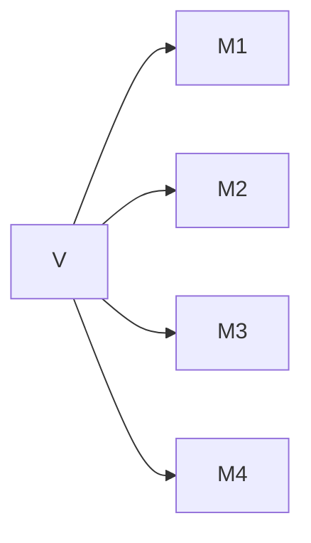
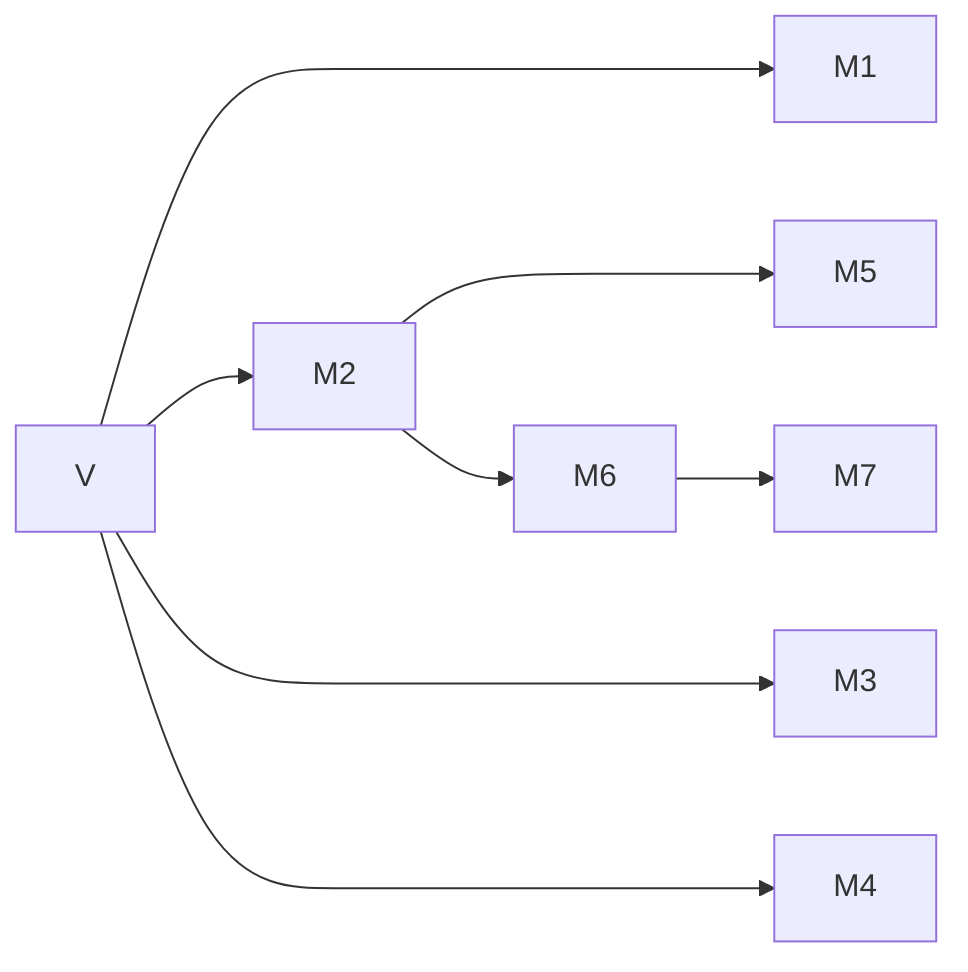
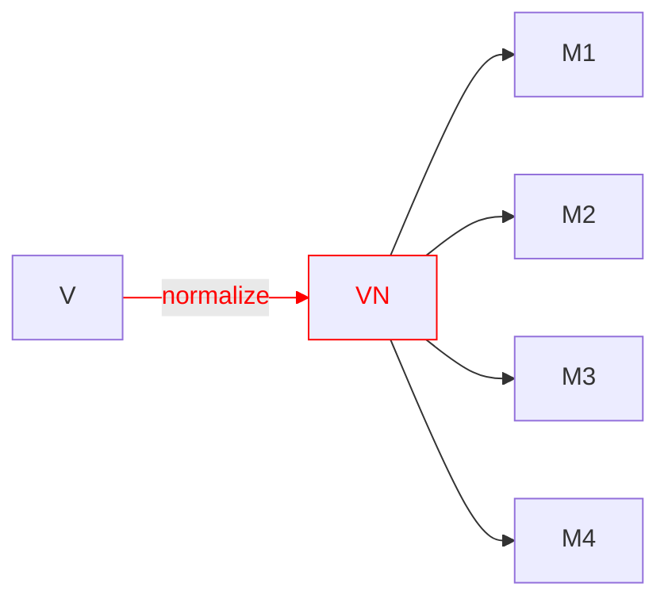
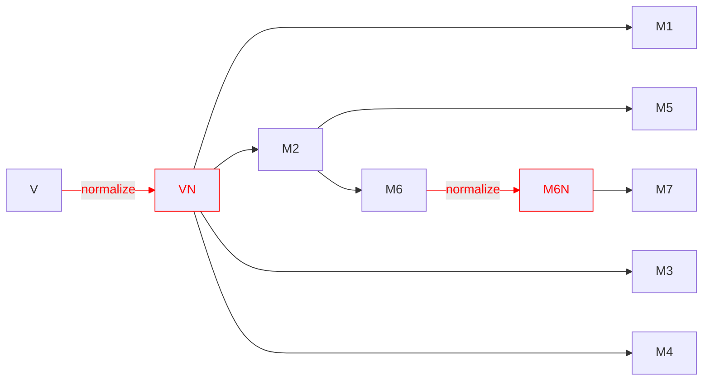
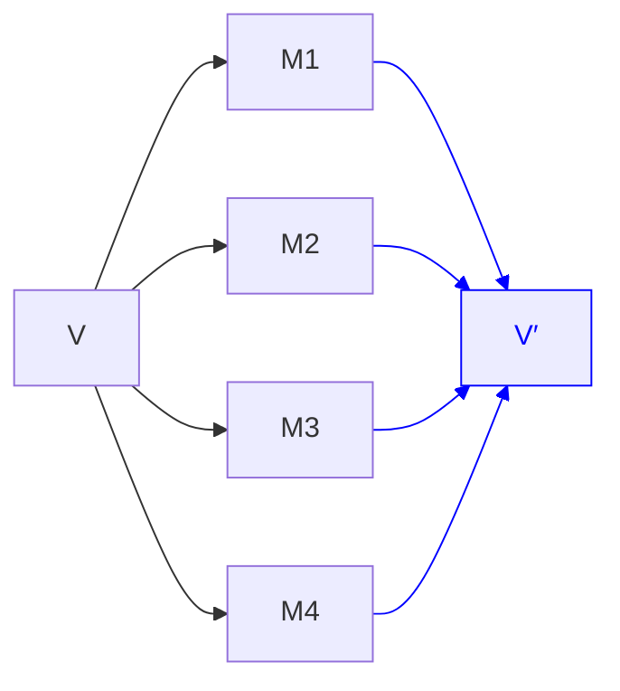
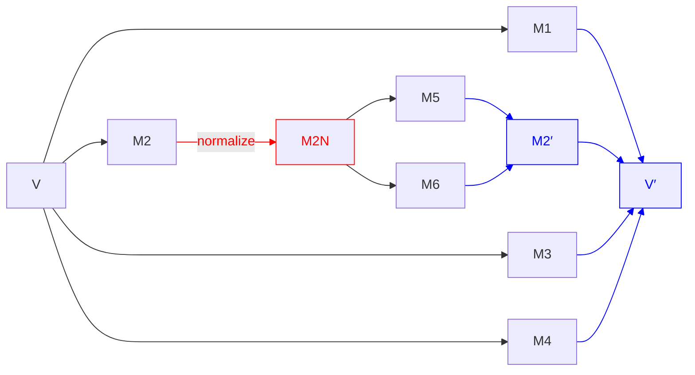

# Revision History

Since [@P3380R0]:

* extended section on [normalization](#normalization) to talk about string literals and proposing properly handling string literals
* renamed the customization point from `operator template` to `to_meta_representation` and `from_meta_representation`
* changed the design from returning a range of `info` to accepting (de)serializer parameters.

# Introduction

This paper is conceptually a follow-up to [@P2484R0], except that it's largely a new design, and I haven't heard back from Richard Smith and didn't want to put his name on ideas I'm not sure he agrees with, despite everything in this paper being derived from his insights.

Recommended reading in advance:

* [@P0732R2] first introduced class types as non-type template parameters, based on defaulted `<=>`. This got later changed to be based on defaulted `==`.
* [@P1907R0] pointed out issues and limitations in this approach
* [@P1907R1] was a revised design based on the concept of structural types, not equality, and was what was adopted for C++20.
* Davis Herring has a great StackOverflow answer [here](https://stackoverflow.com/questions/63694879/floating-point-types-as-template-parameter-in-c20/63714924#63714924) detailing a lot of these issues.
* [@P2484R0] was an idea for C++23 to extend support for class types as non-type template parameters to handle many of the remaining easy cases.
* A [blog post](https://brevzin.github.io/c++/2024/08/15/cnttp/) I wrote on this topic

The status quo right now is that class types that have all of their subobjects public and structural can be used as non-type template parameters. This was an extremely useful addition to C++20, but leaves a lot to be desired. The goal of this paper is to provide a design that will allow all types to be usable as non-type template parameters, provided the correct opt-in. In order to do so, I have to first introduce three concepts: serialization, normalization, and deserialization.

## Serialization

All the work at this point has established pretty clearly that template argument equivalence is a serialization problem. What the defaulted-`<=>` design established, and then the defaulted-`==` design and the structural type design preserved, was that we need to treat a class type as being comprised of a bunch of scalar types and having equivalence be based on those scalars.

However we generalize the non-type template parameter problem to more interesting class types is going to require a mechanism for the user to tell the compiler how their class decomposes. Put differently: how can the compiler serialize your class.

More formally, serialization takes a value `v` and explodes it into some tuple of structural types:



Since the resulting types have to themselves be structural, that means they themselves can be (recursively) serialized. Regardless of what mechanism we could use to specify serialization, the compiler can do the recursive part itself without any user input. So in real life it might look more like this (where the values in the right-most column are those scalar/pointer/reference types that cannot further decompose):



There are many types for which default subobject-wise serialization is actually sufficient — types like `std::tuple<Ts...>`, `std::optional<T>`, `std::expected<T, E>`, `std::variant<Ts...>`, `std::string_view`, `std::span<T>`, etc. For such types, the problem reduces to simply coming up with the right syntax to express that opt-in.

But for other types, simply serializing all the subobjects is insufficient. We have to do a little bit more.

## Normalization

One of the examples that got brought up frequently during discussion is:

::: std
```cpp
struct Fraction {
    int num;
    int denom;
};
```
:::

Should `Fraction{1, 2}` be able to be template-argument-equivalent to `Fraction{2, 4}`? That is, should the serialization process be allowed to also do normalization? Maybe you want to minimize your template instantiations?

I find this particular example difficult to reason about whether it matters, but there is another that I think is more compelling (courtesy of Richard Smith). Consider:

::: std
```cpp
class SmallString {
    char data[32];
    int length = 0; // always <= 32

public:
    // the usual string API here, including
    SmallString() = default;

    constexpr auto data() const -> char const* {
        return data;
    }

    constexpr auto push_back(char c) -> void {
        assert(length < 31);
        data[length] = c;
        ++length;
    }

    constexpr auto pop_back() -> void {
        assert(length > 0);
        --length;
    }
};
```
:::

And add a few functions:

::: std
```cpp
template <SmallString S> struct C { };

constexpr auto f() -> SmallString {
    auto s = SmallString();
    s.push_back('x');
    return s;
}

constexpr auto g() -> SmallString {
    auto s = f();
    s.push_back('y');
    s.pop_back();
    return s;
}
```
:::

Now, we might consider the values returned by `f()` and `g()` to be equal — they're both strings of length 1 whose single character is `x`. But they have different contents of their `data` arrays. So if we do default subobject-wise equivalence (i.e. the C++20 rule), then `C<f()>` and `C<g()>` would be different types. This is unlikely to be the desired effect.

If instead of subobject-wise equivalence, we instead did custom serialization — if we only serialized the contents of `data[:length]` (such that `f()` and `g()` serialize identically), then we have a different problem. Consider:

::: std
```cpp
template <SmallString S>
constexpr auto bad() -> int {
  if constexpr (S.data()[1] == 'y') {
    return 0;
  } else {
    return 1;
  }
}
```
:::

What do `bad<f()>()` and `bad<g()>()` evaluate to, `0` or `1`? Or both? This is an ODR violation, and would be a very bad outcome that we (at least Richard and I) desperately want to avoid.

So far then we have two options for `SmallString`:

1. Opt-in to member-wise equivalence, which leads to two equal values being non-equivalent.
2. Custom serialization, which can lead to ODR violations.

Instead, we can do something else. Prior to serialization, we can optionally perform an extra normalization step. In this case, first we would normalize the representation (by setting `data[length:32]` to `0`) and then we would serialize.

Visually:



Which would naturally recurse:



With such a normalization step, we can get `f()` and `g()` to be template-argument-equivalent in a way that avoids any ODR issues, since now their representations are actually identical.

### String Literals

Another highly motivating use-case for normalization is actually string literals. Currently, string literals are not usable as non-type template parameters. [@P0424R2] tried to address this issue, but was dropped in favor of [@P0732R2]. The latter, while a highly useful addition to the language, technically did not solve the former problem though.

The problem with string literals is that template-argument equivalence for pointers is defined as two pointers having the same pointer value. Which isn't necessarily true for string literals in different translation units.

But this is precisely a use-case for normalization! And the model [@P0424R2] implies basically gets us there, it just needs to be formalized. Basically: if `p` points to a string literal, or a subobject thereof, we can first normalize it by having it instead point to an external linkage array that is mangled with the contents of the string. That is, this:

::: std
```cpp
template <auto V> struct C { };

struct Wrapper { char const* p; };

C<"hello"> c1;
C<Wrapper{.p="hello"}> c2;
```
:::

Can normalize (recursively) into:

::: std
```cpp
template <char const* V> struct C { };

inline constexpr char __hello[] = "hello";
C<__hello> c1;
C<Wrapper{.p=__hello}> c2;
```
:::

As long as we ensure that the backing array has external storage such that the same contents lead to the same variable (which [@P3491R0] demonstrates a library implementation of), this will actually do the right thing. We end up with exactly what users expect, in the way that [@P0424R2] hoped to achieve.

However, this still isn't sufficient...

## Deserialization

Consider `std::vector<T>`. One possible representation of this is:

::: std
```cpp
template <typename T>
class vector {
    T* begin_;
    size_t size_;
    size_t capacity_;
};
```
:::

For our purposes it doesn't matter if `size_t` and `capacity_` are themselves `size_t` or `T*`, so I'm picking the simpler one to reason about.

The template-argument-equivalence rule for pointers is that two pointers are equivalent if they have the same pointer value. That's not what we want for comparing two `std::vector<T>`s though, we want to compare the contents. In order for the default, subobject-wise equivalence to work in this case, we'd have to normalize the pointers to be _identical_. For `std::vector<T>` specifically, this is potentially feasible using a `std::define_static_array` function ([@P3491R0]). But that's not going to help us with `std::map`, `std::list`, or any other container.

For `std::vector<T>`, we really need to serialize a variable-length sequence of `T`s.

As we already saw in the previous section, custom serialization (by which I mean serialization that isn't simply serializing every subobject) can lead to ODR violations if two different objects serialize the same.

This is where deserialization comes in. We say that the template argument value that the user sees in code is the result of first serializing the value, and then passing that serialized state back into the class to construct a new value. Whatever the resulting value that we get out of deserialization, that is _reliably_ the value of the template argument for all values of the original type that compare template-argument-equivalent to each other. We don't have to worry about which of a bunch of possible specializations is chosen by the compiler/linker.

Deserialization actually implicitly does normalization — the roundtrip of a value through (de)serialization is normalized. But while ODR problems can be avoided by careful use of normalization, ODR problems are avoided entirely by construction if we require deserialization. That's pretty appealing. And the process can have some added checks too! The compiler can perform one extra serialization step to ensure that:

::: std
```cpp
serialize(deserialize(serialize(v))) === serialize(v)
```
:::

This check ensures that the round-trip is sound by construction.

In the same way that serialization converts a value into a tuple of structural types, deserialization starts with that tuple of structural types and produces a possibly-new value of the original type:



And in the same way that serialization works recursively in a way that the compiler can take care of for you, deserialization could too. And it's important that it work like this for the same reason. So a more complex diagram might be:



Note that the serialization logic produces <code>M2</code> but the deserialization logic only sees <code>M2′</code>, without the class author having to worry about how to produce it.

## Soundness

There are three approaches that are sound — that is, they avoid ODR issues.

1. Subobject-wise serialization.
2. Subobject-wise serialization with an initial normalization step.
3. Custom serialization with custom deserialization.

Subobject-wise serialization alone (1) already gives us a tremendous amount of value (since this gives us `std::tuple`, `std::optional`, `std::expected`, `std::variant`, `std::span`, and `std::string_view`, among many other types) while still being sound, but we really need custom serialization/deserialization (3) to get the rest of the types (the containers). Allowing normalization (2) helps a small number of types avoid doing all the work that (3) would necessitate.

## Original Design

The [@P2484R0] design was a custom serialization/deserialization design. Given a class type `C`:

* serialization was done by way of an `operator template()` which had to return type `R`, which had to be structural.
* deserialization was done by way of a constructor from `R`.

This approach does satisfy the overall goal of avoiding ODR issues (although the paper does not mention this at all), but the design had some issues.

For one, it doesn't cleanly support the case where we just want member-wise template argument equivalence but our members happen to be `private` (the `tuple`/`optional`/`variant` cases). The paper tried to address this by allowing you to declare `operator template()` as _defaulted_, which doesn't really seem semantically equivalent to the non-defaulted case. A defaulted copy constructor or comparison operator _can_ be written by hand, if tediously, but a defaulted `operator template` would require you duplicating the whole type just to copy it?

Another problem it doesn't clearly support variable-length data. How do we serialize `std::vector<int>`? `std::string`? The `SmallString` class from earlier? The paper kind of punted on this question, suggesting that maybe we just make `std::vector<T>` a structural type by fiat since the language can just know what it means. That's not actually all that unreasonable, but it is a bit unsatisfying.

But it's at least not a bad start. There's a lot to like about this approach:

* it's actually a fairly straightforward way to handle serialization and deserialization, so it does get at the most desirable model for how to extend support for class types as non-type template parameters
* it can properly handle reference members — which must have their template argument equivalence defined as the identity of the object referred to, not its value
* it prevents attempting to do the wrong thing with pointer members.

What I mean by the last point is: how do you define template argument equivalence for `std::string_view`? There's really only one way to do it: as if it were a `std::pair<char const*, size_t>`. If you try to do it the other way (comparing the contents), you'll run into problems on the deserialization side:

::: std
```cpp
class string_view {
    // let's just simplify and ignore the template parameters
    char const* ptr_;
    size_t len_;

    // incorrect approach to serialization
    struct Repr { std::vector<char> v; };
    consteval auto operator template() const -> Repr {
        return Repr{.v=std::vector<char>(ptr_, ptr_ + len_)};
    }

    // the only possible thing deserialization could do?
    consteval string_view(Repr r)
        : ptr_(r.data())
        , len_(r.size())
    { }
}
```
:::

If we serialize the `string_view` as a `vector<char>`, the only way to deserialize would be to refer to the contents of that `vector`. Which immediately goes out of scope, and the compiler can detect that. `ptr_` has to be a permitted result of a constant expression — basically that it has to point to something with static storage duration. And the transient `constexpr` allocation _is not_ that. This error can be detected at compile time.

And that will push you to having the `operator template` implementation for `string_view` be just be defaulted — the correct implementation.

## A Note on Spelling

The original design used an `operator template` function with a constructor. The original revision of this paper ([@P3380R0]) continued the same thing, with a tagged constructor instead. Because the constructor will basically always have to be tagged, and should only ever be invoked by the compiler anyway, this proposal now suggests using `to_meta_representation` and a `static` `from_meta_representation`.

# Reflection Will Fix It

One of the issues with the serialization problem that we had to deal with was: how exactly do you serialize? What representation do you return? And then how do you deserialize again? This was where we got stuck with types like `std::vector` (which needs variable-length representation) and even `std::tuple` (which has a simple answer for serialization but you don't want to just create a whole new tuple type for this). Faisal Vali had the insight that reflection provides a very easy answer for this question: you serialize into (and then deserialize from) a range of `std::meta::info`!

At least, that's what [@P3380R0] did. A refinement of this is, rather than having the serialization function return a range of `std::meta::info`, we can accept a `Serializer` that can push a `meta::info` a `Deserializer` which can pop one. The proposed API for these types (whose actual type is `$unspecified$`):


<table>
<tr><th>Serialize</th><th>Deserialize</th></tr>
<tr><td>
```cpp
struct $Serializer$ {
    consteval auto push(std::meta::info r) -> void;
    consteval auto size() const -> size_t;

    template <class T>
    consteval auto push_value(T const& value) -> void {
        push(std::meta::reflect_value(value));
    }

    template <class T>
    consteval auto push_object(T const& object) -> void {
        push(std::meta::reflect_object(object));
    }

    template <class T>
    consteval auto push_subobjects(T const& obj) -> void {
        template for (constexpr auto M : subobjects_of(^^T)) {
            if (is_reference_type(type_of(M))) {
                push_object(obj.[:M:]);
            } else {
                push_value(obj.[:M:]);
            }
        }
    }

    template <std::ranges::input_range R>
    consteval auto push_range(R&& r) -> void {
        for (auto&& elem : r) {
            push_value(elem);
        }
    }
};
```
</td><td>
```cpp
struct $Deserializer$ {
    consteval auto pop() -> std::meta::info;
    consteval auto size() const -> size_t;

    template <class T>
    consteval auto pop_value() -> T {
        return extract<T>(pop());
    }

    template <class T>
    consteval auto pop_from_subobjects() -> T {
        std::vector<std::meta::info> rs;
        for (std::meta::info _ : subobjects_of(^^T)) {
            rs.push_back(pop());
        }

        // proposed in this paper
        return std::meta::structural_cast<T>(rs);
    }

    // Equivalent to views::generate([this]{ return pop_value<T>(); })
    // except that we don't have a views::generate yet.
    // But the point is to be an input-only range of T
    template <class T>
    consteval auto into_range() -> $unspecified$;
};
```
</td></tr>
</table>

Strictly speaking, the only *necessary* functions are the `push` that takes a `std::meta::info` and the `pop` that returns one. But the added convenience functions are a big ergonomic benefit, as I'll show.

With that in mind, let's start with `SmallString` again. We wanted to serialize just the objects in `data[0:length]`, which is just matter of `push()`-ing those elements. Then, when we deserialize, we extract those values back, knowing that they are all `char`s.

Using the bare minimum `push()` and `pop()` API, that looks like this:

::: std
```cpp
class SmallString {
    char data[32];
    int length;

    template <class S>
    consteval auto to_meta_representation(S& serializer) const -> void {
        for (int i = 0; i < length; ++i) {
            serializer.push(std::meta::reflect_value(data[i]))
        }
    }

    template <class D>
    static consteval auto from_meta_representation(D& deserializer)
        -> SmallString
    {
        // ensure that we zero out all the data
        auto str = SmallString();
        str.length = deserializer.size();
        for (int i = 0; i < length; ++i) {
            str.data[i] = extract<char>(deserializer.pop());
        }
        return str;
    }
};
```
:::

Which if we used the typed APIs (`push_value` and `pop_value`) directly, it's a little simpler:

::: std
```cpp
class SmallString {
    char data[32];
    int length;

    template <class S>
    consteval auto to_meta_representation(S& serializer) const -> void {
        for (int i = 0; i < length; ++i) {
            serializer.push_value(data[i]);
        }
    }

    template <class D>
    static consteval auto from_meta_representation(D& deserializer)
        -> SmallString
    {
        // ensure that we zero out all the data
        auto str = SmallString();
        str.length = deserializer.size();
        for (int i = 0; i < length; ++i) {
            str.data[i] = deserializer.template pop_value<char>();
        }
        return str;
    }
};
```
:::

And lastly the range-based API becomes simpler still:

::: std
```cpp
class SmallString {
    char data[32];
    int length;

    template <class S>
    consteval auto to_meta_representation(S& serializer) const -> void {
        serializer.push_range(*this);
    }

    template <class D>
    static consteval auto from_meta_representation(D& deserializer)
        -> SmallString
    {
        // ensure that we zero out all the data
        auto str = SmallString();
        str.length = deserializer.size();
        std::ranges::copy(deserializer.template into_range<char>(), str.data);
        return str;
    }
};
```
:::

And this pattern works just as well for `std::vector<T>`, which truly requires variable length contents. I'll just skip straight to the range-based API:

::: std
```cpp
template <typename T>
class vector {
    T* begin_;
    size_t size_;
    size_t capacity_;

    template <class S>
    consteval auto to_meta_representation(S& serializer) const -> void {
        serializer.push_range(*this);
    }

    template <class D>
    static consteval auto from_meta_representation(D& deserializer)
        -> vector
    {
        vector v;
        v.begin_ = std::allocator<T>::allocate(deserializer.size());
        v.size_ = v.capacity_ = deserializer.size();
        std::ranges::uninitialized_copy(
            deserializer.template into_range<T>(),
            v.begin_);
        return v;
    }
};
```
:::

One additional point of interest here is that, while this didn't matter for `SmalString`, in the `vector<T>` example we are round-tripping through `reflect_value` and `extract` for arbitrary (structural) `T`. This round-trip also needs to do the custom serialization and deserialization for `T` if that's what the user wants, and will happen automatically without the class author having to do anything.

This approach seems particularly nice in that it handles these disparate cases, without having to special-case `std::vector`.

Let's go through some of the other types we mentioned. For `Optional` we could conditionally serialize the value:

::: std
```cpp
template <typename T>
class Optional {
    union { T value; };
    bool engaged;

    template <class S>
    consteval auto to_meta_representation(S& serializer) const -> void {
        if (engaged) {
            serializer.push_value(value);
        }
    }

    template <class D>
    static consteval auto from_meta_representation(D& deserializer)
        -> Optional
    {
        if (deserializer.size()) {
            return Optional(deserializer.template pop_value<T>());
        } else {
            return Optional();
        }
    }
};
```
:::

But having to manually serialize and deserialize all the elements of a `Tuple` is pretty tedious:

::: std
```cpp
template <typename... Ts>
class Tuple {
    // let's assume this syntax works (because the details are not important here)
    Ts... elems;

    template <class S>
    consteval auto to_meta_representation(S& serializer) const -> void {
        template for (constexpr auto mem : nonstatic_data_members_of(^^Tuple) {
            // references and pointers have different rules for
            // template-argument-equivalence, and thus we need to
            // capture those differences... differently
            if (is_reference_type(type_of(mem))) {
                serializer.push_object(this->[:mem:]);
            } else {
                serializer.push_value(this->[:mem:]);
            }
        }
    }

    template <class D>
    static consteval auto from_meta_representation(D& deserializer)
        -> Tuple
    {
        return Tuple(std::make_index_sequence<sizeof...(Ts)>(), deserializer)
    }

    template <size_t... Is, class D>
    consteval Tuple(index_sequence<Is...>,
                    D& deserializer)
        : elems(deserializer.template pop_value<Ts>())...
    { }
}
```
:::

Cool. This is... a lot. Not only is it a lot of decidedly non-trivial code to write, it's a lot of code that doesn't really do all that much. We're _just_ doing the default member-wise equivalence here. On the one hand, it's good that we _can_ do this. But it's not really great that we _have to_.

To aid in this endeavor, on the `push()` side it's easy to provide a `push_subobjects` convenience functions that just does the right thing with all of the subobjects. But on the `pop()` side you'd want the same thing. There's no such equivalent facility on the deserialization side, since we'd need to be able to directly construct an object of type `T` from reflections of values or objects of suitable type. Even if there may not be such a constructor available! To solve this problem, let's add a new function for this specific case. This is the `structural_cast<T>` that I showed above in the implementation of `pop_from_subobjects`.

That allows this *much* simpler implementation for `Optional` and `Tuple`:

::: std
```cpp
template <typename T>
class Optional {
    union { T value; };
    bool engaged;

    template <class S>
    consteval auto to_meta_representation(S& serializer) const -> void {
        serializer.push_subobjects(*this);
    }

    template <class D>
    static consteval auto from_meta_representation(D& deserializer)
        -> Optional
    {
        return deserializer.template pop_from_subobjects<Optional>();
    }
};

template <typename... Ts>
class Tuple {
    Ts... elems;

    template <class S>
    consteval auto to_meta_representation(S& serializer) const -> void {
        serializer.push_subobjects(*this);
    }

    template <class D>
    static consteval auto from_meta_representation(D& deserializer)
        -> Tuple
    {
        return deserializer.template pop_from_subobjects<Tuple>();
    }
}
```
:::

But... doing subobject-wise serialization is the default, right? So maybe we should just be able to say that explicitly:

::: std
```cpp
template <typename T>
class Optional {
    union { T value; };
    bool engaged;

    consteval auto to_meta_representation(auto& s) const = default;
    static consteval auto from_meta_representation(auto& d) = default;
};

template <typename... Ts>
class Tuple {
    Ts... elems;

    consteval auto to_meta_representation(auto& s) const = default;
    static consteval auto from_meta_representation(auto& d) = default;
}
```
:::


And, furthermore, if `to_meta_representation` ends up serializing the correct number of reflections of the appropriate type, then `from_meta_representation` can really be implicitly defaulted too. That would make our set of examples look like this:


::: std
```cpp
template <typename T>
class Optional {
    union { T value; };
    bool engaged;

    consteval auto to_meta_representation(auto& s) const = default;
};

template <typename... Ts>
class Tuple {
    Ts... elems;

    consteval auto to_meta_representation(auto& s) const = default;
}

class SmallString {
    char data[32];
    int length;

    template <class S>
    consteval auto to_meta_representation(S& serializer) const -> void {
        serializer.push_range(*this);
    }

    template <class D>
    static consteval auto from_meta_representation(D& deserializer)
        -> SmallString
    {
        auto str = SmallString();
        str.length = deserializer.size();
        std::ranges::copy(deserializer.template into_range<char>(), str.data);
        return str;
    }
};

template <typename T>
class Vector {
    T* begin_;
    size_t size_;
    size_t capacity_;

    template <class S>
    consteval auto to_meta_representation(S& serializer) const -> void {
        serializer.push_range(*this);
    }

    template <class D>
    static consteval auto from_meta_representation(D& deserializer)
        -> Vector
    {
        Vector v;
        v.begin_ = std::allocator<T>::allocate(deserializer.size());
        v.size_ = v.capacity_ = deserializer.size();
        std::ranges::uninitialized_copy(
            deserializer.template into_range<T>(),
            v.begin_);
        return v;
    }
};
```
:::

That seems pretty clean. All of these implementations are about as minimal as you could get. `Optional` and `Tuple` simply have to default a single function. `Vector` and `SmallString` have a single-line serializer and a fairly short deserializer.

## Template-Argument Equivalence

For template-argument equivalence, we can say that two values of class type `C` that has a direct `to_meta_representation` member are template-argument-equivalent if:

::: std
```cpp
consteval auto template_argument_equivalent(C const& a, C const& b) -> bool {
    struct Serializer {
        std::vector<std::meta::info> v;
        consteval auto push(std::meta::info r) -> void {
            v.push_back(r);
        }

        // ... rest of API ...
    };

    Serializer sa, sb;
    a.to_meta_representation(sa);
    b.to_meta_representation(sb);
    return sa.v == sb.v;
}
```
:::

That is, two values are template-argument-equivalent if they serialize equal reflections (which would recursively check template-argument-equivalence, as necessary).

## Normalization

The current rule for constructing the template parameter object is that we just initialize a new object of type `const C`. But if a class type provides a direct `to_meta_represention`, then instead of performing the equivalent of:

::: std
```cpp
const C $object$ = C($init$);
```
:::

We would do a round-trip:

::: std
```cpp
const C $object$ = []{
    auto c = C($init$);
    auto $serializer$ = $make-serializer$();
    c.to_meta_representation($serializer$);

    auto $deserializer$ = $make-deserializer$($serializer$);
    return C::from_meta_representation($deserializer$);
}();
```
:::

The actual types of the (de)serializer objects are implementation-defined, the only thing that matters is that they conform to the interface above.

We will also have to adjust `std::meta::reflect_value()` to also do this normalization. Which means:

::: std
```cpp
struct Fraction {
    int numerator;
    int denominator;

    auto operator==(Fraction const&) const -> bool = default;

    template <class S>
    consteval auto to_meta_representation(S& serializer) const -> void {
        // serialize in lowest terms
        auto g = std::gcd(numerator, denominator);
        serializer.push_back(numerator / g);
        serializer.push_back(denominator / g);
    }

    // implicitly-defaulted from_meta_representation does the right thing
};

// round-tripping through reflect_value and extract normalizes
static_assert(extract<Fraction>(reflect_value(Fraction{2, 4})) == Fraction{1, 2});
```
:::

# Proposal

This proposal extends class types as non-type parameters as follows. This isn't exactly Core wording, but does contain something akin to wording because I think that might be a clearer way to express the idea.

## Language

First, as with [@P2484R0], I'm referring to `to_meta_representation` as a template representation function. A class type `T` can provide a `to_meta_representation` that must be of the form:

::: std
```cpp
template <class S>
consteval auto to_meta_representation(S&) const -> void;
```
:::

This function can also be declared as defaulted, in which case every base class and non-static data member shall have structural type. Either way, no non-static data member of `T` can be `mutable`.

We'll say that `T` has an eligible template registration function if it provides `to_meta_representation` as a direct member of the allowed form (possibly-defaulted).

A class type `T` can also provide a `from_meta_representation` that must be of the form:

::: std
```cpp
template <class D>
consteval auto from_meta_representation(D&) -> T;
```
:::

If this function is not provided, it is implicitly defaulted. The defaulted version of the function is:

::: std
```cpp
template <class D>
consteval auto from_meta_representation(D& deserializer) -> T {
    assert(deserializer.size() == subobjects_of(^^T).size());
    return deserializer.template pop_from_subobjects<T>();
}
```
:::

Second, we introduce the concept of template argument normalization (status quo so far is that *template-argument-normalization* is a no-op for all types) and allow string literal template arguments:

::: std
::: addu
A value `v` of structural type `T` is *template-argument-normalized* as follows:

* [#]{.pnum} If `v` is a pointer (or reference) to a string literal or subobject thereof, then let `v` be `S + O`, where `S` is that string literal and `O` is some non-negative offset. Then `v` is normalized to `define_static_string(S) + O` ([@P3491R0]).
* [#]{.pnum} Otherwise, if `T` is a scalar type or an lvalue reference type, nothing is done.
* [#]{.pnum} Otherwise, if `T` is an array type, every element of the array is template-argument-normalized.
* [#]{.pnum} Otherwise (if `T` is a class type), then
  * [#.#]{.pnum} If `T` has an eligible template representation function, then `v` is normalized via:
    ```cpp
    consteval auto $NORMALIZE$(T const& v) -> T {
        auto $s$ = std::meta::make_serializer();
        v.to_meta_representation($s$);
        auto $d$ = std::meta::make_deserializer_from($s$);
        return T::from_meta_representation($d$);
    }
    ```
  * [#.#]{.pnum} Otherwise, every subobject of `v` is template-argument-normalized.
:::
:::

and [temp.arg.nontype]{.sref}/6.2:

::: std
[6]{.pnum} For a non-type template-parameter of reference or pointer type, or for each non-static data member of reference or pointer type in a non-type template-parameter of class type or subobject thereof, the reference or pointer value shall not refer or point to (respectively):

* [6.#]{.pnum} a temporary object ([class.temporary]),

::: rm
* [6.#]{.pnum} a string literal object ([lex.string]),
:::

* [6.#]{.pnum} the result of a `typeid` expression ([expr.typeid]),
* [6.#]{.pnum} a predefined `__func__` variable ([dcl.fct.def.general]), or
* [6.#]{.pnum} a subobject ([intro.object]) of one of the above.
:::

Third, we change the meaning of `std::meta::reflect_value` in [@P2996R7] to perform template-argument-normalization on its argument.

Fourth, we extend the definition of structural (here it's either the first bullet or both of the next two — the additional rules on template registration functions will be covered in their own section):

::: std
A *structural type* is one of the following:

* [7.1]{.pnum} a scalar type, or
* [7.2]{.pnum} an lvalue reference type, or
* [7.2b]{.pnum} [an array type whose element type is structural, or]{.addu}
* [7.3]{.pnum} a literal class [`C`]{.addu} type with the following properties:
    * [7.3.0]{.pnum} [`C` has an eligible template representation function, or ]{.addu}
    * [7.3.1]{.pnum} all base classes and non-static data members [of `C`]{.addu} are public and non-mutable and
    * [7.3.2]{.pnum} the types of all bases classes and non-static data members [of `C`]{.addu} are structural types [or (possibly multidimensional) array thereof]{.rm}.
:::

Fifth, ensure that when initializing a non-type template parameter of class type, that we perform template-argument-normalization. That's in [temp.arg.nontype]{.sref}:

::: std
[4]{.pnum} If `T` is a class type, a template parameter object ([temp.param]) exists that is constructed so as to be template-argument-equivalent to `v` [after it undergoes template-argument-normalization]{.addu}; P denotes that template parameter object. [...]

[5]{.pnum} Otherwise, the value of `P` is that of `v` [after it undergoes template-argument-normalization]{.addu}.
:::

Sixth, we extend the definition of *template-argument-equivalent*. Note that two values of type `std::meta::info` that represent values compare equal if those values are template-argument-equivalent, so this definition is properly recursive. Also note that normalization will have already happened.

::: std
Two values are *template-argument-equivalent* if they are of the same type and [...]

* [2.11]{.pnum} they are of class type [`T`]{.addu} and

    <div class="addu">
    * [2.11.1]{.pnum} If `T` has a eligible template representation function, then the values `v1` and `v2` are template-argument-equivalent if `std::ranges::equal(s1.$output$, s2.$output$)` is `true`, with `s1` and `s2` populated as follows:


      ```cpp
      std::meta::$serializer$ s1, s2;
      v1.to_meta_representation(s1);
      v2.to_meta_representation(s2);
      ```
  </div>

    * [2.11.2]{.pnum} [Otherwise, if]{.addu} their corresponding direct subobjects and reference members are template-argument-equivalent.
:::


## Library

Add a new type trait for `std::is_structural`, which we will need to provide constrained template registration functions (a real use, as [@LWG3354] requested).

Add a defaulted `to_meta_representation` (that is, the default subobject-wise serialization with no normalization):

::: std
```cpp
template<class S>
  consteval void to_meta_representation(S&) = default;
```
:::

to all of the following library types, suitably constrained:

* `std::tuple<Ts...>`
* `std::optional<T>`
* `std::expected<T, E>`
* `std::variant<Ts...>`
* `std::basic_string_view<CharT, Traits>`
* `std::span<T, Extent>`
* `std::chrono::duration<Rep, Period>`
* `std::chrono::time_point<Clock, Duration>`

There may need to be some wording similar to what we have for in [\[pairs.pair\]/4](http://eel.is/c++draft/pairs.pair#4) right now:

::: std
[4]{.pnum} `pair<T, U>` is a structural type ([temp.param]) if `T` and `U` are both structural types.
Two values `p1` and `p2` of type `pair<T, U>` are template-argument-equivalent ([temp.type]) if and only if `p1.first` and `p2.first` are template-argument-equivalent and `p1.second` and `p2.second` are template-argument-equivalent.
:::

Introduce the new reflection function `std::meta::structural_cast<T>` that produces a new value of type `T` given reflections of all the subobjects:

::: std
```cpp
template<reflection_range R = initializer_list<info>>
  consteval T structural_cast(R&&);
```
:::

And introduce unspecified serializer and deserializer types:

::: std
```cpp
namespace std::meta {
    class $serializer$ // exposition-only
    {
        vector<info> $output$; // exposition-only

    public:
        consteval auto push(std::meta::info r) -> void {
            $output$.push_back(r);
        }
        consteval auto size() const -> size_t {
            return $output$.size();
        }

        template <class T>
        consteval auto push_value(T const& value) -> void {
            push(std::meta::reflect_value(value));
        }

        template <class T>
        consteval auto push_object(T const& object) -> void {
            push(std::meta::reflect_object(object));
        }

        template <class T>
        consteval auto push_subobjects(T const& obj) -> void {
            template for (constexpr auto M : subobjects_of(^^T)) {
                if (is_reference_type(type_of(M))) {
                    push_object(obj.[:M:]);
                } else {
                    push_value(obj.[:M:]);
                }
            }
        }

        template <std::ranges::input_range R>
        consteval auto push_range(R&& r) -> void {
            for (auto&& elem : r) {
                push_value(elem);
            }
        }
    };

    struct $deserializer$  // exposition-only
    {
        consteval auto pop() -> std::meta::info;
        consteval auto size() const -> size_t;

        template <class T>
        consteval auto pop_value() -> T {
            return extract<T>(pop());
        }

        template <class T>
        consteval auto pop_from_subobjects() -> T {
            std::vector<std::meta::info> rs;
            for (std::meta::info _ : subobjects_of(^^T)) {
                rs.push_back(pop());
            }

            // proposed in this paper
            return std::meta::structural_cast<T>(rs);
        }

        // Equivalent to views::generate([this]{ return pop_value<T>(); })
        // except that we don't have a views::generate yet.
        // But the point is to be an input-only range of T
        template <class T>
        consteval auto into_range() -> unspecified;
    };

    consteval auto make_serializer() -> $serializer$;
    consteval auto make_deserializer_from($serializer$) -> $deserializer$;
}
```
:::

# Acknowledgements

Thanks to Richard Smith and Davis Herring for all the work in this space. Thanks to Jeff Snyder for originally seeing how to solve this problem (even if we didn't end up using his original solution). Thanks to Faisal Vali and Daveed Vandevoorde for working through a solution.

---
references:
  - id: P3491R0
    citation-label: P3491R0
    title: "`define_static_string` and `define_static_array`"
    author:
      - family: Peter Dimov
      - family: Dan Katz
      - family: Barry Revzin
      - family: Daveed Vandevoorde
    issued:
      - year: 2024
        month: 11
        day: 03
    URL: https://wg21.link/p3491r0
---