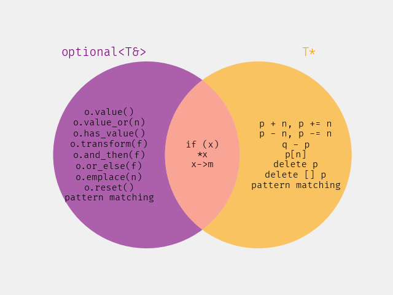

# Revision History

Since [@P3981R0]: discussion at a LEWG telecon lead to deciding to remove `try_append_range` instead of modifying it. See [@P4022R0]{.title}.

# Introduction

This paper seeks to address the following NB comments:

* [PL-006](https://github.com/cplusplus/nbballot/issues/813)
* [US 68-122](https://github.com/cplusplus/nbballot/issues/701)
* [US 150-228](https://github.com/cplusplus/nbballot/issues/799)
* [GB 08-225](https://github.com/cplusplus/nbballot/issues/796)

The new C++26 container `std::inplace_vector<T, N>` contains four functions or function templates which conditionally try to perform some operation, which might fail due to exceeding capacity. Those signatures are currently:

::: std
```cpp
template<class... Args>
  constexpr pointer try_emplace_back(Args&&... args);
constexpr pointer try_push_back(const T& x);
constexpr pointer try_push_back(T&& x);

template<$container-compatible-range$<T> R>
  constexpr ranges::borrowed_iterator_t<R> try_append_range(R&& rg);
```
:::

We argue in this paper that there is a better choice for the return type for each of these algorithms: `optional<reference>` for the first three ~~and `ranges::borrowed_subrange_t<R>` for the fourth~~.

We are aware that [@P3739R4]{.title} exists, but we feel that this is an important change to make, and that paper's motivation is weak, has a misleading title (it has nothing to do with standard library hardening), and argues for a return type of `optional<T&> const`, which is not a good idea.

# `T*` makes for a poor `optional<T&>`

The functions `emplace_back` and `push_back` return a `reference` to the new element that was added to the container. The functions `try_emplace_back` and `try_push_back` seek to do the same thing, except that these functions signal failure via the return path: they can only _conditionally_ return a reference to the element that was added, so they need to return something else on failure.

When [@P0843R14]{.title} was adopted, the only sensible choice for the return type was `T*`: either a pointer that points to the new element or a null pointer. However, now that [@P2988R12]{.title} was adopted for C++26, there is another choice: `optional<T&>`. These types are, superficially, quite similar to each other. And, indeed, whenever the idea of an optional reference comes up, inevitably somebody will bring up the point that we don't need `optional<T&>` because we already have `T*`. Barry wrote a whole blog post several years about about how [`T*` makes for a poor `optional<T&>`](https://brevzin.github.io/c++/2021/12/13/optional-ref-ptr/) responding to this claim.

There are several significant benefits to `optional<T&>` when it comes to the return type here, which we will enumerate.

First, as you can already see in the opening paragraph of this section, in some ways `optional<T&>` is already inherently the correct choice. We have `push_back` returning a `T&`. So `try_push_back`, which instead of having a precondition simply tries and might fail, should return an `optional<T&>`. That is the general shape of fallible functions.

Second, consider the semantics. `T*` has many possible semantics: it is either an owning or non-owning pointer, that could point to a single object, to an array of objects, or past-the-end of an object or array. In our case, we are returning either a reference to a single object or nothing — which is exactly the singular semantic of `optional<T&>`.

Third, consider the potential API of the return type:



There are some operations that `T*` and `optional<T&>` share in the middle, those have the same semantics and meaning either way. All of the operations in the purple circle are highly relevant and useful to this problem. We want to have an optional reference, so it is useful to have the chaining operations that give us a different kind of optional, or to provide a default value, or to emplace or reset, or even to have a throwing accessor. But all the operations in the orange circle are highly _irrelevant_ to this problem and would be completely wrong to use. They are bugs waiting to happen. We we don’t have an owning pointer, so neither `delete` nor `delete []` are valid. We happen to have an array, but the indexing operations are pretty questionable (are people going to use negative indices here?). Nevertheless, these operations will actually compile.

You'll note that "pattern matching" appears in both circles, differently — this is because [@P2688R5]{.title} supports matching both `optional<U>` and `T*`, but they are matched _differently_:

* an `optional<U>` matches against `U` or `nullopt`, because that's precisely what it represents.
* a `T*` doesn't match against a `T`, rather it matches polymorphically.

We still won't have pattern matching in C++26, but if we ever do, we'll want to be able to match on whether our optional reference actually contains a reference, or not. We do not need to match whether we're holding a derived type or not.

Fourth, with standard library hardening, we know that `*x` and `x->m` will be checked if `x` is an `optional<T&>`. But there is no such guaranteed checking for raw pointers. Hopefully, you segfault?

These are very significant benefits to returning `optional<T&>`. There are simply no benefits to returning `T*`.

## The same holds for `std::exception_ptr_cast<E>`

Similarly, `std::exception_ptr_cast<E>(p)` was introduced by [@P2927R3]{.title}, and the exact same arguments hold. That function wants to either return an object or nothing. `optional<E const&>` is simply a better return type than `E const*` here. With the additional argument that here even the indexing operations are undefined behavior, whereas for the `std::inplace_vector`  case they are simply questionable.

## Other related functions

There are two other, closely related functions in the standard library that each conditionally return a reference to an object: `std::any_cast` (the form that returns a pointer) and `std::get_if` (for `std::variant`). For both of these functions, `std::optional<T&>` didn't exist yet, so the only option was `T*` (and we are not suggesting changing them now), but this behavior has proved quite clunky in practice. Now that we have a better option, we should use it.

# Iterator or Subrange?

A previous revision of this paper made the argument that `v.try_append_range(r)` should return a `subrange` instead of an `iterator` (as pointed out by PL-006). But we've decided it is best to remove the function entirely for now, see [@P4022R0]{.title}. This paper no longer proposes any changes.

# Why not do this?

[@P3830R0]{.title} argues that we simply should not make this change, mostly on the basis that it is new. Which, yes, the specific specialization `std::optional<T&>` is new, and it took unnecessarily long to adopt it after `std::optional<T>` was adopted (despite its existence in Boost for decades, and proliferation across many other `optional` implementations). But the notion of an optional reference in general is not new, and we have a lot of experience with it outside of the standard library — and even outside of C++. The Rust standard library returns optional references from many APIs quite liberally.

The paper additionally points out several issues with `std::optional<T&>` specifically, which are:

* [@LWG4299] and [@LWG4300] are basically typos and were already both fixed.
* [@LWG4308] is more interesting, but not really relevant to the question of whether to use it in `std::inplace_vector`, and was already fixed.
* That `optional<T&>` wasn't explicitly specified to be trivially copyable was also basically a typo, and was also already fixed by [@P3836R2]{.title}.

None of which sound to us like reasons to not make these changes.

# Proposal

We propose to change the return types of ~~four~~ three algorithms in `std::inplace_vector<T, N>`: `try_emplace_back` and both overloads of `try_push_back` to return `optional<T&>` instead of `T*` And to likewise change the return type of `std::exception_ptr_cast` from `E const*` to `optional<E const&>`.

## Wording

Change [exception.syn]{.sref}:

::: std
```diff
// all freestanding
namespace std {
  // ...
- template<class E> constexpr const E* exception_ptr_cast(const exception_ptr& p) noexcept;
+ template<class E> constexpr optional<const E&> exception_ptr_cast(const exception_ptr& p) noexcept;
  template<class E> void exception_ptr_cast(const exception_ptr&&) = delete;
  // ...
}
```
:::

Change [propagation]{.sref}/14-15:

::: std
```diff
- template<class E> constexpr const E* exception_ptr_cast(const exception_ptr& p) noexcept;
+ template<class E> constexpr optional<const E&> exception_ptr_cast(const exception_ptr& p) noexcept;
```

[14]{.pnum} *Mandates*: [...]

[15]{.pnum} *Returns*: [A pointer to the]{.rm} [The]{.addu} exception object referred to by `p`, if `p` is not null and a handler of type `const E&` would be a match ([except.handle]) for that exception object. Otherwise, [`nullptr`]{.rm} [`nullopt`]{.addu}.
:::

Change the synopsis in [inplace.vector.overview]{.sref}:

::: std
```diff
namespace std {
  template<class T, size_t N>
  class inplace_vector {
  public:

    // ...

    // [inplace.vector.modifiers], modifiers
    template<class... Args>
      constexpr reference emplace_back(Args&&... args);                     // freestanding-deleted
    constexpr reference push_back(const T& x);                              // freestanding-deleted
    constexpr reference push_back(T&& x);                                   // freestanding-deleted
    template<container-compatible-range<T> R>
      constexpr void append_range(R&& rg);                                  // freestanding-deleted
    constexpr void pop_back();

    template<class... Args>
-     constexpr pointer try_emplace_back(Args&&... args);
+     constexpr optional<reference> try_emplace_back(Args&&... args);
-   constexpr pointer try_push_back(const T& x);
-   constexpr pointer try_push_back(T&& x);
+   constexpr optional<reference> try_push_back(const T& x);
+   constexpr optional<reference> try_push_back(T&& x);
    template<container-compatible-range<T> R>
      constexpr ranges::borrowed_iterator_t<R> try_append_range(R&& rg);

    // ...
  };
}
```
:::

Change [inplace.vector.modifiers]{.sref}/8-11:

::: std
```diff
  template<class... Args>
-   constexpr pointer try_emplace_back(Args&&... args);
+   constexpr optional<reference> try_emplace_back(Args&&... args);
- constexpr pointer try_push_back(const T& x);
- constexpr pointer try_push_back(T&& x);
+ constexpr optional<reference> try_push_back(const T& x);
+ constexpr optional<reference> try_push_back(T&& x);
```
[8]{.pnum} Let vals denote a pack: [...]

[9]{.pnum} *Preconditions*: [...]

[10]{.pnum} *Effects*: [...]

[11]{.pnum} *Returns*: [`nullptr`]{.rm} [`nullopt`]{.addu} if `size() == capacity()` is `true`, otherwise [`addressof(back())`]{.rm} [`back()`]{.addu}.
:::

## Feature-Test Macros

Bump the two relevant macros in [version.syn]{.sref}:

::: std
```diff
- #define __cpp_lib_inplace_vector                    202406L // also in <inplace_vector>
+ #define __cpp_lib_inplace_vector                    2026XXL // also in <inplace_vector>

- #define __cpp_lib_exception_ptr_cast                202506L  // also in <exception>
+ #define __cpp_lib_exception_ptr_cast                2026XXL  // also in <exception>
```
:::


---
references:
  - id: P3981R0
    citation-label: P3981R0
    title: "Better return types in `std::inplace_vector` and `std::exception_ptr_cast`"
    author:
      - family: Barry Revzin
      - family: Jonathan Wakely
      - family: Tomasz Kamiński
    issued:
      - year: 2026
        month: 01
        day: 27
    URL: https://wg21.link/p3980r0
  - id: P4022R0
    citation-label: P4022R0
    title: "Remove `try_append_range` from `inplace_vector` for now"
    author:
      - family: Barry Revzin
      - family: Jonathan Wakely
      - family: Tomasz Kamiński
    issued:
      - year: 2026
        month: 02
        day: 22
    URL: https://wg21.link/p4022r0
---